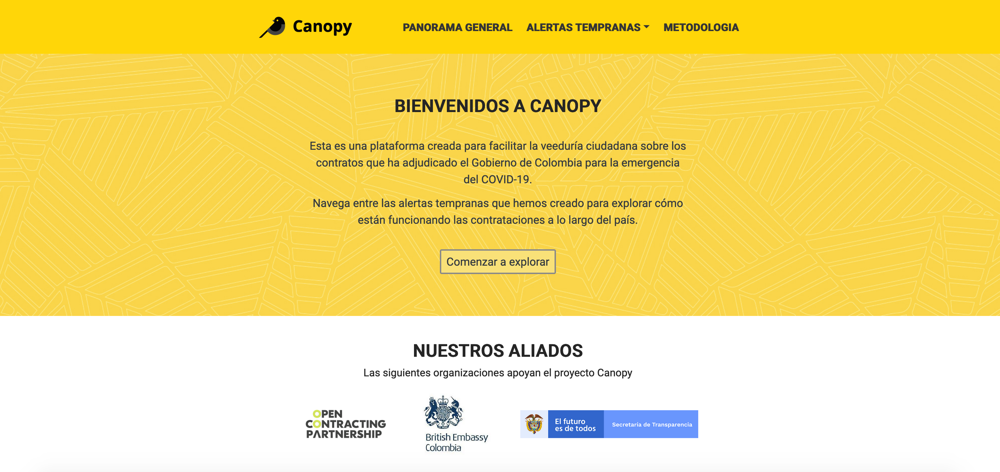

# Canopy Platform Demo

## About this app
_Demo: Platform for detection of risky COVID contracts in Colombia (Canopy Platform)._

You can check the resulting web page in https://bit.ly/2NktiZj (page in Spanish)

## How to run this app (locally)

(The following instructions apply to macOS/linux command line.)

To run this app first clone repository and then open a terminal.

```
git clone https://github.com/melissamnt/canopy-demo.git
```

Install the requirements:

```
pip install -r requirements.txt
```

Run the app:

```
python app_local/app.py
```
You can run the app on your browser at http://127.0.0.1:8050


## Screenshots

